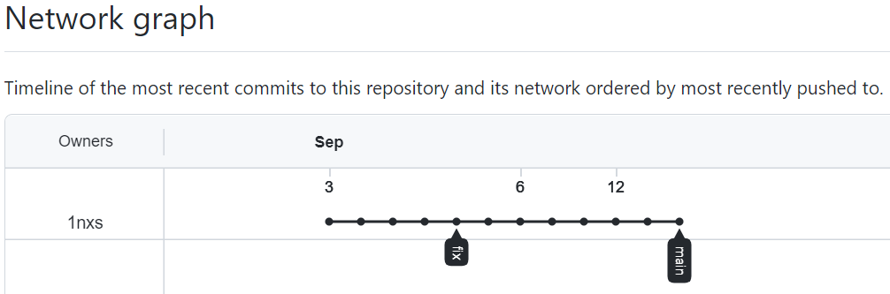

# Домашнее задание к занятию «2.2. Основы Git»

## Задание №1 – Знакомимся с GitLab (обязательно) и bitbucket (по желанию)

### Gitlab

    $ git remote -v
    gitlab  https://gitlab.com/1nxs/devops-netology.git (fetch)
    gitlab  https://gitlab.com/1nxs/devops-netology.git (push)
    origin  https://github.com/1nxs/devops-netology.git (fetch)
    origin  https://github.com/1nxs/devops-netology.git (push)
## Задание №2 – Теги

Представьте ситуацию, когда в коде была обнаружена ошибка - надо вернуться на предыдущую версию кода, исправить ее и выложить исправленный код в продакшн. Мы никуда код выкладывать не будем, но пометим некоторые коммиты тегами и создадим от них ветки.

1. 

    $ git tag v0.0
    $ git show v0.0
        commit b294dd29758a04529c941bfc5bcecd8027991d2d (HEAD -> main, tag: v0.0, origin/main, origin/HEAD, gitlab/main)
        Author: Pavel Yakushin <yakushin.pavel+netology@gmail.com>
        Date:   Tue Sep 6 20:47:34 2022 +0300

2.  

    $ git tag -a v0.1 -m "annotation version 01"
    $ git show v0.1
    tag v0.1
    Tagger: Pavel Yakushin <yakushin.pavel+netology@gmail.com>
    Date:   Mon Sep 12 18:35:42 2022 +0300
    
    annotation version 01
    
    commit b294dd29758a04529c941bfc5bcecd8027991d2d (HEAD -> main, tag: v0.1, tag: v0.0, origin/main, origin/HEAD, gitlab/main)
    Author: Pavel Yakushin <yakushin.pavel+netology@gmail.com>
    Date:   Tue Sep 6 20:47:34 2022 +0300

## Задание №3 – Ветки
1-6:

    $ git log
    commit 6b28469068f53406969355596505432cc74d5418
    Author: pavel.yakushin <yakushin.pavel@gmail.com>
    Date:   Sat Sep 3 23:20:22 2022 +0300

        Prepare to delete and move
    $ git checkout 6b28469068f53406969355596505432cc74d5418
    $ git switch -c fix
    $ git push -u origin fix
7-8: Network pics 
 - Прямая 
 - Ветка 

