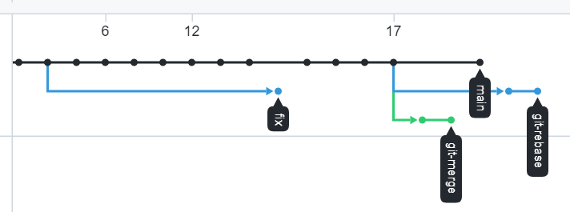
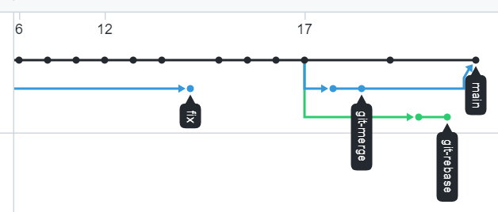
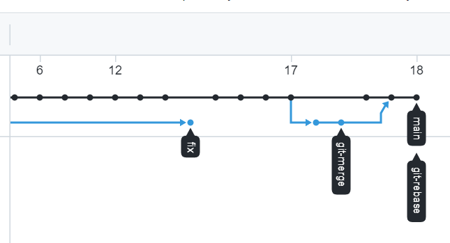

# Домашнее задание к занятию «2.3. Ветвления в Git»

Давайте потренеруемся делать merge и rebase, чтобы понять разницу и научиться решать конфликты.

## Задание №1 – Ветвление, merge и rebase.

1. Создайте в своем репозитории каталог `branching` и в нем два файла `merge.sh` и `rebase.sh` с содержимым:

```bash
$ mkdir branching
$ touch merge.sh
$ touch rebase.sh
$ vi rebase.sh
$ vi merge.sh
```

#### Подготовка файла merge.sh.

```bash
$ git branch "git-merge"
$ git checkout git-merge
$ vi merge.sh
$ git add merge.sh
$ git commit -m "merge: @ instead *"
$ vi merge.sh
$ git add merge.sh
$ git commit -m "merge: use shift"
$ git push --set-upstream origin git-merge
```
#### Изменим main.
```bash
$ git checkout main
$ vi rebase.sh
$ git add rebase.sh
$ git commit -m "rebase: new line"
$ git push origin main
```
#### Изменим main.Подготовка файла rebase.sh.
```bash
$ git log --oneline
$ git checkout b7fe8d5
$ git branch "git-rebase"
$ git checkout git-rebase
$ vi rebase.sh
$ git add rebase.sh
$ git commit -m "git-rebase 1"
$ vi rebase.sh
$ git add rebase.sh
$ git commit -m "rgit-rebase 2"
$ git push --set-upstream origin git-rebase
```
#### Промежуточный итог.<br>


#### Merge
```bash
$ git merge git-merge
$ git push
```


#### Rebase
```BASH
$ git checkout git-rebase
$ git branching/rebase -i main
$ vi rebase.sh
$ git add branching/rebase.sh
$ git rebase --continue
$ vi branching/rebase.sh
$ git add branching/rebase.sh
$ git rebase --continue
$ git push
$ git push origin git-rebase -f
$ git checkout main
$ git merge git-rebase
$ git push
```
