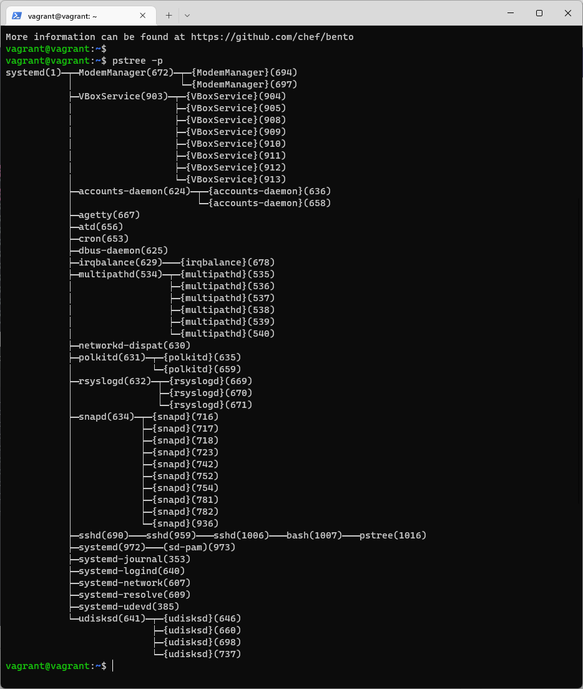

# Домашнее задание к занятию "3.2. Работа в терминале, лекция 2"

1. Какого типа команда `cd`? Попробуйте объяснить, почему она именно такого типа; опишите ход своих мыслей, если считаете что она могла бы быть другого типа.

Это встроенная команда оболочки:

```
$ type cd
cd is a shell builtin
```
Если бы она была внешней, то запускалась бы в отдельном процессе и меняла бы директорию для этого процесса (текущий каталог shell оставался бы неизменным).
2. Какая альтернатива без pipe команде `grep <some_string> <some_file> | wc -l`? `man grep` поможет в ответе на этот вопрос. Ознакомьтесь с [документом](http://www.smallo.ruhr.de/award.html) о других подобных некорректных вариантах использования pipe.

`grep <some_string> <some_file> -c`

3. Какой процесс с PID `1` является родителем для всех процессов в вашей виртуальной машине Ubuntu 20.04?

> `systemd`, об этом говорят `pstree` и `/proc`




```bash
# Всё тоже самое но короче:
$ pstree -a -p  | head -n 1
systemd,1

# Всё чудесатее и чудесатее! `init`, который по-сути симлинк на `systemd`
$ ps -F 1
UID          PID    PPID  C    SZ   RSS PSR STIME TTY      STAT   TIME CMD
root           1       0  0 42163 12924   1 19:04 ?        Ss     0:02 /sbin/init
```

4. Как будет выглядеть команда, которая перенаправит вывод stderr `ls` на другую сессию терминала?
Вызов из pts/0:
```bash
vagrant@vagrant:~$ ls -l \root 2>/dev/pts/1
vagrant@vagrant:~$ 
```    
Вывод в другой сессии pts/1:    
```bash
vagrant@vagrant:~$ who
vagrant  pts/0        2020-11-01 12:58 (10.0.2.2)
vagrant  pts/1        2020-11-01 12:59 (10.0.2.2)
vagrant@vagrant:~$ ls: cannot access 'root': No such file or directory
```

5. Получится ли одновременно передать команде файл на stdin и вывести ее stdout в другой файл? Приведите работающий пример.
```bash
# На вскидку
# cat < test1.txt > test2.txt
vagrant@vagrant:~$ cat test1
test1 text
vagrant@vagrant:~$ cat test2
vagrant@vagrant:~$ cat <test1 >test2
vagrant@vagrant:~$ cat test2
test1 text

```
6. Получится ли вывести находясь в графическом режиме данные из PTY в какой-либо из эмуляторов TTY? Сможете ли вы наблюдать выводимые данные?
 ```bash
   echo hello >/dev/tty2
   ```

   Наблюдать выводимые данные возможно при переключении на соответствующий авторизованный терминал (ctrl+alt+F2)

7. Выполните команду `bash 5>&1`. К чему она приведет? Что будет, если вы выполните `echo netology > /proc/$$/fd/5`? Почему так происходит?

`bash 5>&1` запустит экземпляр bash с дополнительным фаловым дескриптором "5" и перенаправит его на ф/д 1 (stdout).

`echo netology > /proc/$$/fd/5` выведет в дескриптор 5 "netology", т.к. дескриптор 5 перенаправлен в stdout "netology" мы увидим в терминале.

8. Получится ли в качестве входного потока для pipe использовать только stderr команды, не потеряв при этом отображение stdout на pty? Напоминаем: по умолчанию через pipe передается только stdout команды слева от `|` на stdin команды справа.
Это можно сделать, поменяв стандартные потоки местами через промежуточный новый дескриптор, который вы научились создавать в предыдущем вопросе.

Получится. Для этого нужно "поменять местами STDOUT и STDERR". Для этого применяется конструкция `N>&1 1>&2 2>&N` (где N - новый промежуточный дескриптор).
* Например:


В результате получили, что в pipe передается stdout с дескриптором 2 (stderr)

9. Что выведет команда `cat /proc/$$/environ`? Как еще можно получить аналогичный по содержанию вывод?

Будут выведены переменные окружения:
можно получить тоже самое (только с разделением по переменным по строкам):
printenv
env
10. Используя `man`, опишите что доступно по адресам `/proc/<PID>/cmdline`, `/proc/<PID>/exe`.

`/proc/[pid]/cmdline` - файл только на чтение, который содержит строку запуска процессов, кроме зомби-процессов \
`/proc/[pid]/exe` -  ссодержит символическую ссылку указывающую на исполняемый файл процесса загруженный в память ядра

12. Узнайте, какую наиболее старшую версию набора инструкций SSE поддерживает ваш процессор с помощью `/proc/cpuinfo`.

* SSE 4.2 

13. При открытии нового окна терминала и `vagrant ssh` создается новая сессия и выделяется pty. Это можно подтвердить командой `tty`, которая упоминалась в лекции 3.2. Однако:

    ```bash
	vagrant@netology1:~$ ssh localhost 'tty'
	not a tty
    ```

	Почитайте, почему так происходит, и как изменить поведение.

Это сделано для правильной работы в скриптах. Если сразу выполнить команду на удалённом сервере через ssh, sshd это поймёт, и запускаемые команды тоже, поэтому они не будут спрашивать что-то у пользователя, а вывод очистят от лишних данных.\
Например, если в интерактивном режиме программа задала бы пользователю вопрос и ждала ответа "yes/no", при запуске через ssh она этого делать не станет.\
По умолчанию при запуске команды через SSH не выделяется TTY. Если же не указывать команды, то TTY будет выдаваться, так как предполагается, что будет запущен сеанс оболочки.\
Изменить поведение можно через `ssh localhost` с последующей авторизацией и выполнением `'tty'`. Либо через `ssh -t localhost 'tty'`

14. Бывает, что есть необходимость переместить запущенный процесс из одной сессии в другую. Попробуйте сделать это, воспользовавшись `reptyr`. Например, так можно перенести в `screen` процесс, который вы запустили по ошибке в обычной SSH-сессии.

[Мануал](https://github.com/nelhage/reptyr#typical-usage-pattern) проекта `reptyr` \
Ещё по [документации](https://github.com/nelhage/reptyr#ptrace_scope-on-ubuntu-maverick-and-up) потребовалось поменять настройку модуля YAML, и судя по [описанию](https://www.kernel.org/doc/html/v4.15/admin-guide/LSM/Yama.html), это не очень хорошо, но нам надо.\
Сработало в итоге после правки `/proc/sys/kernel/yama/ptrace_scope`

15. `sudo echo string > /root/new_file` не даст выполнить перенаправление под обычным пользователем, так как перенаправлением занимается процесс shell'а, который запущен без `sudo` под вашим пользователем. Для решения данной проблемы можно использовать конструкцию `echo string | sudo tee /root/new_file`. Узнайте что делает команда `tee` и почему в отличие от `sudo echo` команда с `sudo tee` будет работать.

`tee` - получает значения из stdin и записывает их в stdout и файл.
Так как `tee` запускается отдельным процессом из-под sudo, то получая в stdin через pipe данные от `echo` - у нее есть права записать в файл.