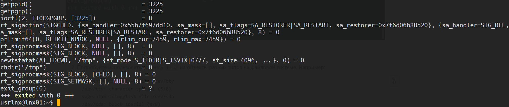
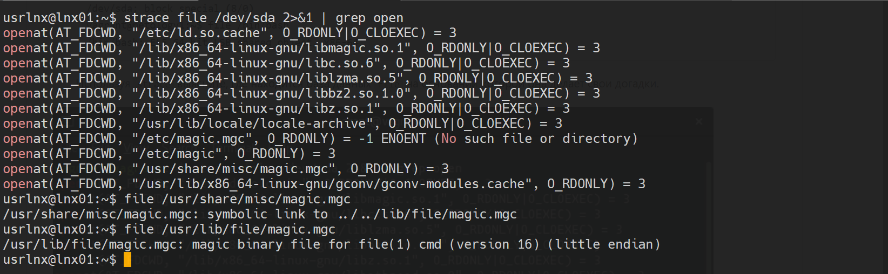
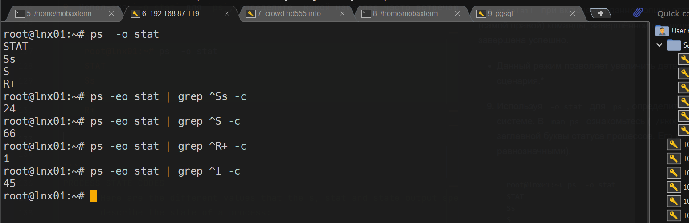

# Домашнее задание к занятию "3.3. Операционные системы, лекция 1"

1. Какой системный вызов делает команда `cd`? В прошлом ДЗ мы выяснили, что `cd` не является самостоятельной  программой, это `shell builtin`, поэтому запустить `strace` непосредственно на `cd` не получится. Тем не менее, вы можете запустить `strace` на `/bin/bash -c 'cd /tmp'`. В этом случае вы увидите полный список системных вызовов, которые делает сам `bash` при старте. Вам нужно найти тот единственный, который относится именно к `cd`.
* chdir()

* можно проверить
   ```bash
       $ diff <(strace /bin/bash -c 'cd /tmp' 2>&1 | cut -d'(' -f 1 | sort | uniq) <(strace /bin/bash -c 'alias' 2>&1 | cut -d'(' -f 1 | sort | uniq)
       4d3
       < chdir
   ```
2. Попробуйте использовать команду `file` на объекты разных типов на файловой системе. Например:
    ```bash
    vagrant@netology1:~$ file /dev/tty
    /dev/tty: character special (5/0)
    vagrant@netology1:~$ file /dev/sda
    /dev/sda: block special (8/0)
    vagrant@netology1:~$ file /bin/bash
    /bin/bash: ELF 64-bit LSB shared object, x86-64
    ```
    Используя `strace` выясните, где находится база данных `file` на основании которой она делает свои догадки.

* Используется файл расположенный по адресу "/usr/share/misc/magic.mgc" -> "/usr/lib/file/magic.mgc". \
 


3. Предположим, приложение пишет лог в текстовый файл. Этот файл оказался удален (deleted в lsof), однако возможности сигналом сказать приложению переоткрыть файлы или просто перезапустить приложение – нет. Так как приложение продолжает писать в удаленный файл, место на диске постепенно заканчивается. Основываясь на знаниях о перенаправлении потоков предложите способ обнуления открытого удаленного файла (чтобы освободить место на файловой системе).

   > Можно сделать так - ``echo ""| sudo tee /proc/PID/fd/DESCRIPTOR``, \
где ``PID`` - это PID процесса, который записывает в удаленный файл, а ``DESRIPTOR`` - дескриптор, удаленного файла.

   Пример:
   ```bash
   $ exec 5> output.file
   $ ping localhost >&5
   # а теперь удаляем файл
   $ rm output.file
   
   $ sudo lsof | grep deleted
   bash      1094                        usrlnx    5w      REG              253,0    12863    1052121 /home/usrlnx/output.file (deleted)
   ping      3236                        usrlnx    1w      REG              253,0    12863    1052121 /home/usrlnx/output.file (deleted)
   ping      3236                        usrlnx    5w      REG              253,0    12863    1052121 /home/usrlnx/output.file (deleted)
   
   # тперь нужно "энуть" пустую строку в дескриптор
   $ echo ""| tee /proc/1094/fd/5 
   ```


4. Занимают ли зомби-процессы какие-то ресурсы в ОС (CPU, RAM, IO)?

Зомби-процессы не занимают какие-либо системные ресурсы, но сохраняют свой ID процесса (есть риск исчерпания доступных идентификаторов)

5. В iovisor BCC есть утилита `opensnoop`:
    ```bash
    root@vagrant:~# dpkg -L bpfcc-tools | grep sbin/opensnoop
    /usr/sbin/opensnoop-bpfcc
    ```
    На какие файлы вы увидели вызовы группы `open` за первую секунду работы утилиты? Воспользуйтесь пакетом `bpfcc-tools` для Ubuntu 20.04. Дополнительные [сведения по установке](https://github.com/iovisor/bcc/blob/master/INSTALL.md).
   ```bash
   $ dpkg -L bpfcc-tools | grep sbin/opensnoop
   /usr/sbin/opensnoop-bpfcc
   $ /usr/sbin/opensnoop-bpfcc
   742    vminfo              4   0 /var/run/utmp
   652    dbus-daemon        -1   2 /usr/local/share/dbus-1/system-services
   652    dbus-daemon        21   0 /usr/share/dbus-1/system-services
   652    dbus-daemon        -1   2 /lib/dbus-1/system-services
   652    dbus-daemon        21   0 /var/lib/snapd/dbus-1/system-services/
   ```

6. Какой системный вызов использует `uname -a`? Приведите цитату из man по этому системному вызову, где описывается альтернативное местоположение в `/proc`, где можно узнать версию ядра и релиз ОС.

* системный вызов `uname()`\
   ```bash
   $ man -k uname
   arch (1)             - print machine hardware name (same as uname -m)
   uname (1)            - print system information
   # что-бы заполучить `uname(2)` нужен пакет manpages-dev
   $ sudo apt install manpages-dev
   $ man -k uname
   arch (1)             - print machine hardware name (same as uname -m)
   oldolduname (2)      - get name and information about current kernel
   olduname (2)         - get name and information about current kernel
   uname (1)            - print system information
   uname (2)            - get name and information about current kernel
   # Профит
   ```
   > Part of the utsname information is also accessible via /proc/sys/kernel/{ostype, hostname, osrelease, version, domainname}.

7. Чем отличается последовательность команд через `;` и через `&&` в bash? Например:
    ```bash
    root@netology1:~# test -d /tmp/some_dir; echo Hi
    Hi
    root@netology1:~# test -d /tmp/some_dir && echo Hi
    root@netology1:~#
    ```
    Есть ли смысл использовать в bash `&&`, если применить `set -e`?

   * `;`  

Для выполнения команд которые будут выполнены последовательно, одна за другой.

Для этого используется специальный оператор `;`
Если написать в командной строке:

```Bash
$ mkdir /tmp/new-folder ; cd /tmp/new-folder
```
то оболочка вначале запустит на выполнение команду `mkdir /tmp/new-folder`, выполнится создание каталога, после чего выполнится перемещение в директорию `cd /tmp/new-folder`.   
* `&&`  

Оператор `&&` является управляющим оператором. Если в командной строке стоит `command1 && command2`, то `command2` выполняется в том случае, если статус выхода из команды `command1` имеет нулевой статус, что говорит об успешном ее завершении.   

`set -e` установка или снятие значений параметров оболочки. Использование с && не имеет смысла, т.к. с `-e` произойдет немедленный выход, если команда завершается с ненулевым статусом.

8. Из каких опций состоит режим bash `set -euxo pipefail` и почему его хорошо было бы использовать в сценариях?

`-e` завершает сессию, если выполненная команда дала ненулевой статус выхода;\
`-u` обрабатывает неустановленные или неопределенные переменные, за исключением специальных параметров, таких как подстановочные знаки (\*) или «@», как ошибки во время раскрытия параметра;\
`-x` выводит команды и аргументы во время выполнения;\
`-o pipefail` при включении данной опции статус выхода из конвейера является значением последней (самой правой) команды, завершённой с ненулевым статусом, или ноль — если работа всех команд завершена успешно.

- Данный режим позволяет увеличить детализацию логирования и обнаружить ошибки при выполнении сценария.* 

9. Используя `-o stat` для `ps`, определите, какой наиболее часто встречающийся статус у процессов в системе. В `man ps` ознакомьтесь (`/PROCESS STATE CODES`) что значат дополнительные к основной заглавной буквы статуса процессов. Его можно не учитывать при расчете (считать S, Ss или Ssl равнозначными).


    ```
    PROCESS STATE CODES
           Here are the different values that the s, stat and state output specifiers (header "STAT" or "S") will display to
           describe the state of a process:
                   D    uninterruptible sleep (usually IO)
                   I    Idle kernel thread
                   R    running or runnable (on run queue)
                   S    interruptible sleep (waiting for an event to complete)
                   T    stopped by job control signal
                   t    stopped by debugger during the tracing
                   W    paging (not valid since the 2.6.xx kernel)
                   X    dead (should never be seen)
                   Z    defunct ("zombie") process, terminated but not reaped by its parent
           For BSD formats and when the stat keyword is used, additional characters may be displayed:
                   <    high-priority (not nice to other users)
                   N    low-priority (nice to other users)
                   L    has pages locked into memory (for real-time and custom IO)
                   s    is a session leader
                   l    is multi-threaded (using CLONE_THREAD, like NPTL pthreads do)
                   +    is in the foreground process group
    ```