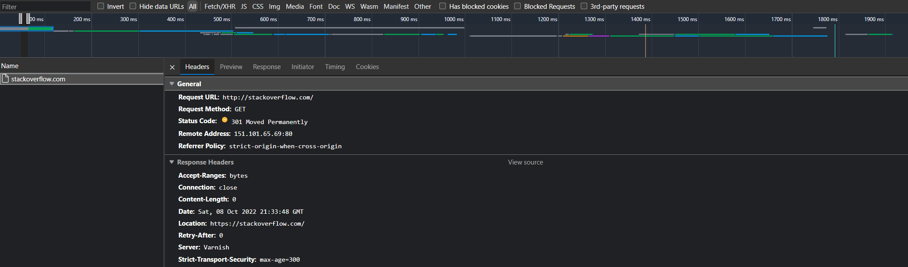
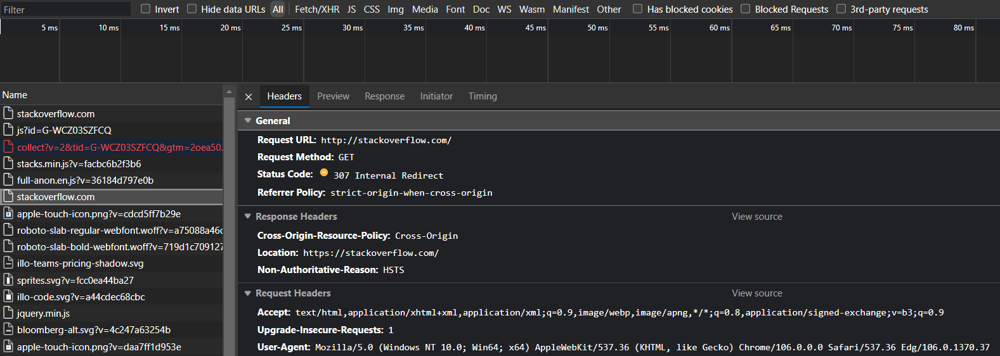

# Домашнее задание к занятию "3.6. Компьютерные сети, лекция 1"

1. Работа c HTTP через телнет.
- Подключитесь утилитой телнет к сайту stackoverflow.com
`telnet stackoverflow.com 80`
- отправьте HTTP запрос
```bash
GET /questions HTTP/1.0
HOST: stackoverflow.com
[press enter]
[press enter]

```
```shell
vagrant@vagrant:~$ telnet stackoverflow.com 80
Trying 151.101.65.69...
Connected to stackoverflow.com.
Escape character is '^]'.
GET /questions HTTP/1.0
HOST: stackoverflow.com

HTTP/1.1 301 Moved Permanently
Connection: close
Content-Length: 0
Server: Varnish
Retry-After: 0
Location: https://stackoverflow.com/questions
Accept-Ranges: bytes
Date: Sat, 08 Oct 2022 20:52:19 GMT
Via: 1.1 varnish
X-Served-By: cache-fra19130-FRA
X-Cache: HIT
X-Cache-Hits: 0
X-Timer: S1665262339.025782,VS0,VE0
Strict-Transport-Security: max-age=300
X-DNS-Prefetch-Control: off

Connection closed by foreign host.
```

- В ответе укажите полученный HTTP код, что он означает?
  * ответ 301: это редиект на другой URL, он указан в поле location. В даном случае, адрес тот же, но протокол HTTPS.
2. Повторите задание 1 в браузере, используя консоль разработчика F12.
- откройте вкладку `Network`
- отправьте запрос http://stackoverflow.com
- найдите первый ответ HTTP сервера, откройте вкладку `Headers`
- укажите в ответе полученный HTTP код.
- проверьте время загрузки страницы, какой запрос обрабатывался дольше всего?
- приложите скриншот консоли браузера в ответ.
  * При первой загрузке 301 редирект\
  
  * При последующих 307 редирект\
  
  * timeline\
  
  * total time\
  

3. Какой IP адрес у вас в интернете?

```shell
vagrant@vagrant:~$ curl ifconfig.me
185.13.1xx.xxxvagrant@vagrant:~$
```

4. Какому провайдеру принадлежит ваш IP адрес? Какой автономной системе AS? Воспользуйтесь утилитой `whois`

```shell
vagrant@vagrant:~$ whois 185.13.xxx.xxx  | grep ^org-name
org-name:       Morton-Telekom Ltd
vagrant@vagrant:~$ whois 185.13.xxx.xxx  | grep ^origin
origin:         AS29069
```
5. Через какие сети проходит пакет, отправленный с вашего компьютера на адрес 8.8.8.8? Через какие AS? Воспользуйтесь утилитой `traceroute`

Серые сетки >> Ростелеком >> Google
```shell
vagrant@vagrant:~$ traceroute -An 8.8.4.4
traceroute to 8.8.4.4 (8.8.4.4), 30 hops max, 60 byte packets
 1  192.168.87.1 [*]  1.568 ms  1.742 ms  2.131 ms
 2  172.16.16.8 [*]  3.075 ms  3.241 ms  4.046 ms
 3  172.31.5.1 [*]  4.588 ms  4.733 ms  4.720 ms
 4  185.13.115.85 [AS29069]  6.323 ms  6.395 ms  6.759 ms
 5  72.14.204.81 [AS15169]  4.631 ms  4.618 ms  4.604 ms
 6  * * *
 7  108.170.250.33 [AS15169]  5.699 ms 72.14.233.90 [AS15169]  3.802 ms 66.249.95.40 [AS15169]  3.637 ms
 8  108.170.250.99 [AS15169]  5.379 ms 108.170.250.146 [AS15169]  4.081 ms 108.170.250.66 [AS15169]  4.471 ms
 9  142.251.78.106 [AS15169]  17.320 ms 142.250.238.214 [AS15169]  20.005 ms 142.251.237.154 [AS15169]  42.027 ms
10  142.251.238.66 [AS15169]  20.826 ms 172.253.65.159 [AS15169]  19.064 ms 108.170.235.204 [AS15169]  19.040 ms
11  172.253.79.237 [AS15169]  17.582 ms 172.253.64.53 [AS15169]  19.560 ms 142.250.56.131 [AS15169]  20.703 ms
---
20  * * *
21  8.8.4.4 [AS15169]  19.652 ms  18.037 ms  17.808 ms
```
```shell
vagrant@vagrant:~$ grep org-name <(whois AS29069)
org-name:       PJSC Rostelecom
vagrant@vagrant:~$ grep OrgName <(whois AS15169)
OrgName:        Google LLC
```
6. Повторите задание 5 в утилите `mtr`. На каком участке наибольшая задержка - delay?
```shell
vagrant@vagrant:~$ mtr 8.8.8.8 -znrc 1
Start: 2022-10-08T21:58:04+0000
HOST: vagrant                     Loss%   Snt   Last   Avg  Best  Wrst StDev
  1. AS???    192.168.87.1         0.0%     1    1.6   1.6   1.6   1.6   0.0
  2. AS???    172.16.16.8          0.0%     1    2.0   2.0   2.0   2.0   0.0
  3. AS???    172.31.5.1           0.0%     1    2.3   2.3   2.3   2.3   0.0
  4. AS29069  185.13.115.85        0.0%     1    2.9   2.9   2.9   2.9   0.0
  5. AS15169  72.14.204.81         0.0%     1    3.8   3.8   3.8   3.8   0.0
  6. AS15169  142.251.64.109       0.0%     1    2.9   2.9   2.9   2.9   0.0
  7. AS15169  108.170.250.83       0.0%     1    4.0   4.0   4.0   4.0   0.0
  8. AS15169  142.250.239.64       0.0%     1   19.2  19.2  19.2  19.2   0.0
  9. AS15169  108.170.232.251      0.0%     1   18.3  18.3  18.3  18.3   0.0
 10. AS15169  172.253.51.237       0.0%     1   21.3  21.3  21.3  21.3   0.0
 11. AS???    ???                 100.0     1    0.0   0.0   0.0   0.0   0.0
 12. AS???    ???                 100.0     1    0.0   0.0   0.0   0.0   0.0
 13. AS???    ???                 100.0     1    0.0   0.0   0.0   0.0   0.0
 14. AS???    ???                 100.0     1    0.0   0.0   0.0   0.0   0.0
 15. AS???    ???                 100.0     1    0.0   0.0   0.0   0.0   0.0
 16. AS???    ???                 100.0     1    0.0   0.0   0.0   0.0   0.0
 17. AS???    ???                 100.0     1    0.0   0.0   0.0   0.0   0.0
 18. AS???    ???                 100.0     1    0.0   0.0   0.0   0.0   0.0
 19. AS???    ???                 100.0     1    0.0   0.0   0.0   0.0   0.0
 20. AS15169  8.8.8.8              0.0%     1   16.0  16.0  16.0  16.0   0.0
```
  * 10 хоп отвечает дольше всех

7. Какие DNS сервера отвечают за доменное имя dns.google? Какие A записи? воспользуйтесь утилитой `dig`
```shell
# NS
vagrant@vagrant:~$ dig +short NS dns.google
ns4.zdns.google.
ns2.zdns.google.
ns1.zdns.google.
ns3.zdns.google.
# A
vagrant@vagrant:~$ dig +short A dns.google
8.8.8.8
8.8.4.4
```

8. Проверьте PTR записи для IP адресов из задания 7. Какое доменное имя привязано к IP? воспользуйтесь утилитой `dig`
```shell
# В обоих случаях dns.google.
vagrant@vagrant:~$ for ip in `dig +short A dns.google`; do dig -x $ip | grep ^[0-9].*in-addr; done
8.8.8.8.in-addr.arpa.   11871   IN      PTR     dns.google.
4.4.8.8.in-addr.arpa.   18928   IN      PTR     dns.google.
```