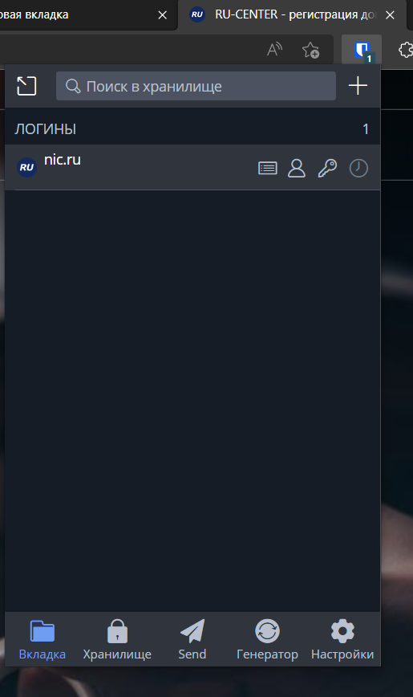
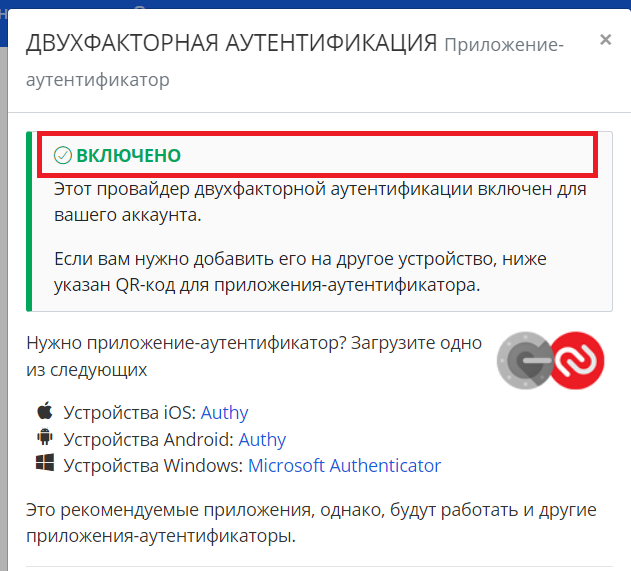
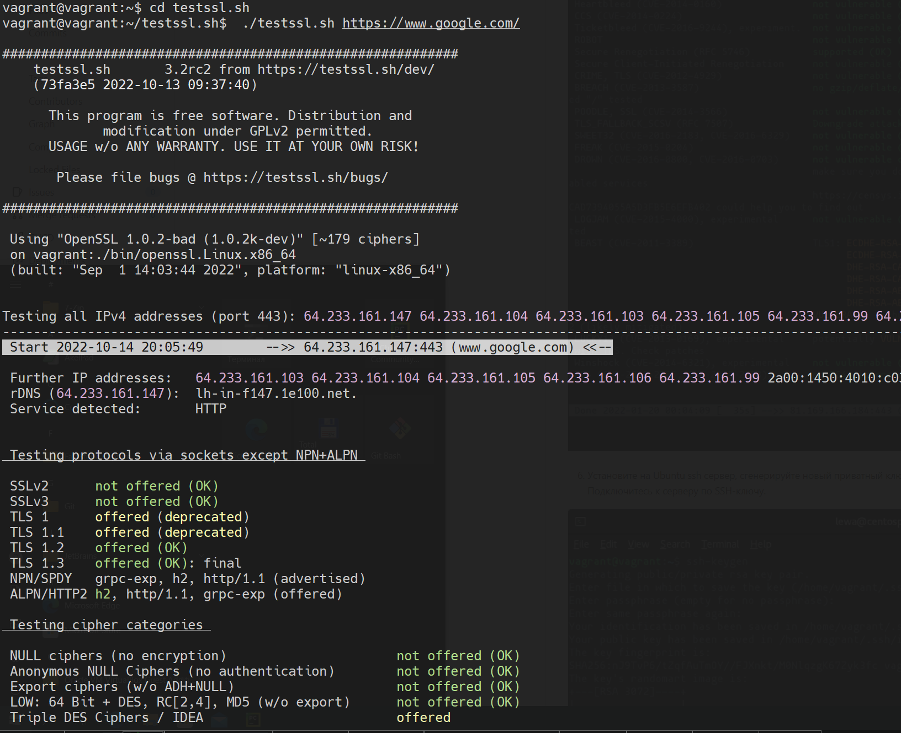

# Домашнее задание к занятию "3.9. Элементы безопасности информационных систем"

1. Установите Bitwarden плагин для браузера. Зарегестрируйтесь и сохраните несколько паролей.\

2. Установите Google authenticator на мобильный телефон. Настройте вход в Bitwarden акаунт через Google authenticator OTP.\

3. Установите apache2, сгенерируйте самоподписанный сертификат, настройте тестовый сайт для работы по HTTPS.
```shell
vagrant@vagrant:~$ sudo apt install apache2
vagrant@vagrant:~$ sudo openssl req -x509 -nodes -days 90 -newkey rsa:2048 -keyout /etc/ssl/private/ap                                                                                                 ache-selfsigned.key -out /etc/ssl/private/apache-selfsigned.crt -subj "/C=RU/ST=Moscow/L=Moscow/O=MyCompany/OU=ORG/CN=www.nowhere.com"ache-selfsigned.key -out /etc/ssl/private/apache-selfsigned.crt -subj "/C=RU/ST=Moscow/L=Moscow/O=MyCompany/OU=ORG/CN=www.nowhere.com"
vagrant@vagrant:~$ sudo ls -la /etc/ssl/private/
-rw-r--r-- 1 root root     1350 Oct 14 19:06 apache-selfsigned.crt
-rw------- 1 root root     1704 Oct 14 19:06 apache-selfsigned.key
vagrant@vagrant:~$ sudo vi /etc/apache2/conf-available/ssl-params.conf
#---
vagrant@vagrant:~$ sudo cat /etc/apache2/conf-available/ssl-params.conf
SSLCipherSuite EECDH+AESGCM:EDH+AESGCM:AES256+EECDH:AES256+EDH
SSLProtocol All -SSLv2 -SSLv3 -TLSv1 -TLSv1.1
SSLHonorCipherOrder On
# Disable preloading HSTS for now.  You can use the commented out header line that includes
# the "preload" directive if you understand the implications.
# Header always set Strict-Transport-Security "max-age=63072000; includeSubDomains; preload"
Header always set X-Frame-Options DENY
Header always set X-Content-Type-Options nosniff
# Requires Apache >= 2.4
SSLCompression off
SSLUseStapling on
SSLStaplingCache "shmcb:logs/stapling-cache(150000)"
# Requires Apache >= 2.4.11
SSLSessionTickets Off
#---
vagrant@vagrant:~$ sudo cp /etc/apache2/sites-available/default-ssl.conf /etc/apache2/sites-available/default-ssl.conf.bak
vagrant@vagrant:~$ sudo vi /etc/apache2/sites-available/default-ssl.conf
vagrant@vagrant:~$ sudo -i
root@vagrant:# a2enmod ssl
root@vagrant:# a2enmod headers
root@vagrant:# a2ensite default-ssl
root@vagrant:# a2enconf ssl-params
root@vagrant:# apache2ctl configtest
root@vagrant:# sudo apache2ctl configtest
AH00558: apache2: Could not reliably determine the server fully qualified domain name, using 127.0.1.1. Set the 'ServerName' directive globally to suppress this message
Syntax OK
root@vagrant:# systemctl restart apache2
```


4. Проверьте на TLS уязвимости произвольный сайт в интернете (кроме сайтов МВД, ФСБ, МинОбр, НацБанк, РосКосмос, РосАтом, РосНАНО и любых госкомпаний, объектов КИИ, ВПК ... и тому подобное).
```shell
vagrant@vagrant:~$ git clone --depth 1 https://github.com/drwetter/testssl.sh.git
vagrant@vagrant:~$ cd testssl.sh
vagrant@vagrant:~/testssl.sh$  ./testssl.sh https://www.google.com/
```


5. Установите на Ubuntu ssh сервер, сгенерируйте новый приватный ключ. Скопируйте свой публичный ключ на другой сервер. Подключитесь к серверу по SSH-ключу.
```shell
vagrant@vagrant:~/testssl.sh$ ssh-keygen -C "yakushin.pavel+netology@gmail.com"
Generating public/private rsa key pair.
Enter file in which to save the key (/home/vagrant/.ssh/id_rsa):
Enter passphrase (empty for no passphrase):
Enter same passphrase again:
Your identification has been saved in /home/vagrant/.ssh/id_rsa
Your public key has been saved in /home/vagrant/.ssh/id_rsa.pub
The key fingerprint is:
SHA256:--- yakushin.pavel+netology@gmail.com
The key's randomart image is:
+---[RSA 3072]----+
|      .o.o. . .  |
|        +.+. + . |
|       ..=.+o =  |
|      ..+ .+.o .o|
|       +S. .+   +|
|      = . .+ o ..|
|     + o  ..B.B .|
|    E o  o.=.O.o |
|         o= +.   |
+----[SHA256]-----+
```

```shell
# До добавления отпечатка в github
vagrant@vagrant:~/testssl.sh$ ssh -T git@github.com
git@github.com: Permission denied (publickey).
# после добавления отпечатка в github
vagrant@vagrant:~$ cat ~/.ssh/id_rsa.pub
ssh-rsa ***qh+GeneRvEc+ycOOKgHjnS8rN++++boj+vFNg9bJ2tL6***vsGYwi46W0= yakushin.pavel+netology@gmail.com
vagrant@vagrant:~h$ ssh -T git@github.com
Hi 1nxs! You've successfully authenticated, but GitHub does not provide shell access.
```
6. Переименуйте файлы ключей из задания 5. Настройте файл конфигурации SSH клиента, так чтобы вход на удаленный сервер осуществлялся по имени сервера.

```shell
vagrant@vagrant:~$ mv ~/.ssh/id_rsa ~/.ssh/id_rsa_git
vagrant@vagrant:~$ ls ~/.ssh/
authorized_keys  id_rsa_git       id_rsa.pub       known_hosts      known_hosts.old
vagrant@vagrant:~$ vi ~/.ssh/config
vagrant@vagrant:~$ cat ~/.ssh/config
Host githab
  HostName github.com
  IdentityFile ~/.ssh/id_rsa_git
  User git
vagrant@vagrant:~$ ssh githab
PTY allocation request failed on channel 0
Hi 1nxs! You`ve successfully authenticated, but GitHub does not provide shell access.
Connection to github.com closed.
vagrant@vagrant:~$
```

7. Соберите дамп трафика утилитой tcpdump в формате pcap, 100 пакетов. Откройте файл pcap в Wireshark.
```shell
vagrant@vagrant:~$ sudo tcpdump -c 100 -w trash.pcap
tcpdump: listening on enp0s3, link-type EN10MB (Ethernet), snapshot length 262144 bytes
100 packets captured
102 packets received by filter
0 packets dropped by kernel
```

можно посмотреть на icmp пакет\


 ---
## Задание для самостоятельной отработки (необязательно к выполнению)

8*. Просканируйте хост scanme.nmap.org. Какие сервисы запущены?
```shell
vagrant@vagrant:~$ nmap scanme.nmap.org
Starting Nmap 7.80 ( https://nmap.org ) at 2022-10-14 20:55 UTC
Nmap scan report for scanme.nmap.org (45.33.32.156)
Host is up (0.19s latency).
Other addresses for scanme.nmap.org (not scanned): 2600:3c01::f03c:91ff:fe18:bb2f
Not shown: 996 closed ports
PORT      STATE SERVICE
22/tcp    open  ssh
80/tcp    open  http
9929/tcp  open  nping-echo
31337/tcp open  Elite

Nmap done: 1 IP address (1 host up) scanned in 17.98 seconds
```
Соответсвенно - запущен sshd, веб-сервер, сервер nping и вишенка `H4XØR`
<details>
«1»=«l», «3»=«e», «7»=«t». Отсылка в прошлое и слэнг..<br>
Надпись «31337» = слово «eleet» и символизирует принадлежность к хакерской элите.
</details>

9*. Установите и настройте фаервол ufw на web-сервер из задания 3. Откройте доступ снаружи только к портам 22,80,443

```shell
root@vagrant:# ufw status verbose
Status: active
Logging: on (low)
Default: deny (incoming), allow (outgoing), disabled (routed)
New profiles: skip

To                         Action      From
--                         ------      ----
22/tcp                     ALLOW IN    Anywhere
80,443/tcp (Apache Full)   ALLOW IN    Anywhere
```


