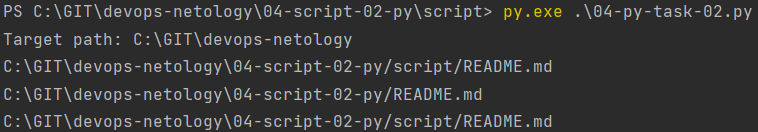
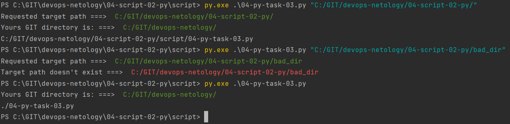
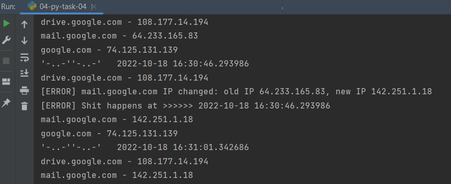

### [Задание 2](04-py-task-02.py)

```python
#!/usr/bin/env python3
# * исправлен стоковый путь (windows)
# - лишняя логическая переменная is_change
# - команда brake прерывает обработку при первом же найденом вхождении
# + введена переменная пути к папке
# + добавлена проверка на новые файлы
import os

target="C:\\GIT\\devops-netology"
print(f'Target path: {target}')
bash_command = ["cd "+target, "git status"]
result_os = os.popen(' && '.join(bash_command)).read()
#is_change = False
for result in result_os.split('\n'):
    if result.find('modified') != -1:
        prepare_result = result.replace('\tmodified:   ', '').replace('#','')
        print(os.path.join(target,prepare_result))
        #break
    elif result.find('new file') != -1:
        prepare_result = result.replace('\tnew file:   ', '').replace('#','')
        print(os.path.join(target, prepare_result))
```
- вывод теста:<br>


### [Задание 3](04-py-task-03.py)

```python
#!/usr/bin/env python3
#==task 3==

# + используется текущая директория если не указан путь явным образом
# + добавлена провера на несуществующую директорию
# - убран мусор
# - убрана проверка new file - в целом текущая перекрывает этот тред
# * добавлено чуть раскраски

# ==task 2 ==
# * исправлен стоковый путь (windows)
# - лишняя логическая переменная is_change
# - команда brake прерывает обработку при первом же найденом вхождении
# + введена переменная пути к папке
# + добавлена проверка на новые файлы

import os
import sys

target = "./"
# Проверка аргумента пути к репозиторию
# Если аргументы введены, то проверяем директорию
if len(sys.argv) >= 2:
    target = sys.argv[1]
    print(f"Requested target path ===> \033[32m {target}" "\033[0m")
# Если директории не существует - завершаем выполнение скрипта с ошибкой
    if not os.path.isdir(target):
        sys.exit("Target path doesn't exist ===>  " "\033[31m" + target +"\033[0m")

bash_command = ["cd "+target, "git status 2>&1"]
# Если это не GIT репозиторий, прерываем скрипт
result_os = os.popen(' && '.join(bash_command)).read()
if result_os.find('not a git') != -1:
    sys.exit("but it's not a git repository :( " "\033[31m" + target +"\033[0m")
# Получаем верхний уровень GIT репозитория
git_command = ["git rev-parse --show-toplevel"]
git_top_level = (os.popen(' && '.join(git_command)).read()).replace('\n', '/')
print(f"Yours GIT directory is: ===> \033[32m {git_top_level}" "\033[0m")
for result in result_os.split('\n'):
    if result.find('modified') != -1:
        prepare_result = result.replace('\tmodified:   ', '').replace('#','')
        print(os.path.join(target,prepare_result))
#    elif result.find('new file') != -1:
#       prepare_result = result.replace('\tnew file:   ', '').replace('#','')
#        print(os.path.join(target, prepare_result))
```
- вывод теста:<br>


### [Задание 4](04-py-task-04.py)
```python
#!/usr/bin/env python3
#
from datetime import datetime
import socket
import time

# Нули
service_host = {
    'drive.google.com': '0',
    'mail.google.com': '0',
    'google.com': '0'
}
# Получаем текущие значения
for host in service_host:
    initial_ip = socket.gethostbyname(host)
    service_host[host] = initial_ip

while True:
    # Пишем время старта цикла
    dt = datetime.now()
    print("'-..-''-..-'  ", dt)
    # Перебираем хосты из словаря
    for host in service_host:
        old_ip = service_host[host]
        new_ip = socket.gethostbyname(host)
        # Проверяем значение, если не совпадает то записываем в словарь и ругаемся ошибкой
        if new_ip != old_ip:
            service_host[host] = new_ip
            print("[ERROR] "+host+" IP changed: old IP "+old_ip+", new IP "+new_ip)
            print("[ERROR] Shit happens at >>>>>>", dt)
        print(host + " - " + service_host[host])
    time.sleep(10)
```
- вывод теста:<br>
