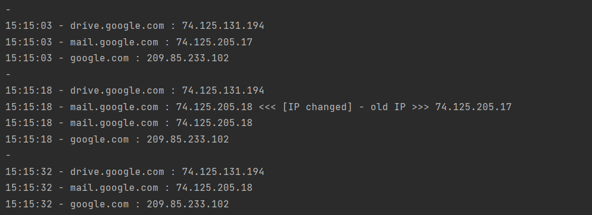

### [Задание 2](04-yaml-task-02.py)
В целом, можно использовать несколько разных подходов к конструкции
#### вариант 1
Модифицировать цикл для записи результата.
Минус в том, что создастся много файлов, что при использовании в проде дало бы бОльшую нагрузку.
Но задачу учебную он всё равно решает.
<details>

```python
while True:
    # Пишем время старта цикла
    dt = datetime.datetime.now()
    dd = dt.strftime('%d-%m-%Y %H:%M:%S')
    print("'-..-''-..-'  ", dd)
    # Перебираем хосты из словаря
    for host in service_host:
        old_ip = service_host[host]
        new_ip = socket.gethostbyname(host)
        # Проверяем значение, если не совпадает то записываем в словарь и ругаемся ошибкой
        if new_ip != old_ip:
            service_host[host] = new_ip
            print("[ERROR] "+host+" IP changed: old IP "+old_ip+", new IP "+new_ip)
            print("[ERROR] Shit happens at >>>>>>", dd)
            with open(host + '.json', 'w') as output_json:
                # Формируем json
                data_json = json.dumps({host: service_host[host]})
                # Записываем его в файл
                output_json.write(data_json)
            # Записываем полученные данные в виде yaml файла
            with open(host + '.yaml', 'w') as output_yaml:
                # Формируем yaml
                data_yaml = yaml.dump([{host: service_host[host]}])
                # Записываем его в файл
                output_yaml.write(data_yaml)
        print(host + " - " + service_host[host])
    time.sleep(10)
```
</details>

#### вариант 2
Сделать функцию записи в файл
```python
#!/usr/bin/env python3
# * изменена обработка времени
# + выводит в файл в форматах yaml и json
# + заменено форматирование вывода на экран

import datetime
import socket
import time
import json
import yaml

# Нули
service_host = {
    'drive.google.com': '0',
    'mail.google.com': '0',
    'google.com': '0'
}
# Получаем текущие значения
for host in service_host:
    initial_ip = socket.gethostbyname(host)
    service_host[host] = initial_ip

# запись в формате json \ yaml
def wr_json_yaml(y):
    with open('service_host.json', 'w') as jtmp:
        jtmp.write(str(json.dumps(y)))
    with open('service_hosts.yaml', 'w') as ytmp:
        ytmp.write(yaml.dump(y))
    return

while True:
    # Определяем время для каждого цикла
    dtn = datetime.datetime.now()
    d = dtn.strftime('%H:%M:%S')
    print("-")
    # Перебираем хосты из словаря
    for host in service_host:
        old_ip = service_host[host]
        new_ip = socket.gethostbyname(host)
        # Проверяем значение, если не совпадает то записываем в словарь и ругаемся ошибкой
        if new_ip != old_ip:
            service_host[host] = new_ip
            print(d+ " - " +host+ " : " +new_ip+ " <<< [IP changed] - old IP >>> "+old_ip+"")
        print(d+ " - "+host+ " : " +service_host[host])
        wr_json_yaml(service_host)
    time.sleep(10)
```
- вывод теста:<br>


- вывод в файл в формате [json](service_host.json)
```json
{"drive.google.com": "74.125.131.194", "mail.google.com": "74.125.205.18", "google.com": "209.85.233.102"}
```
- вывод в фафй в формате [yaml](service_hosts.yaml)
```yaml
drive.google.com: 74.125.131.194
google.com: 209.85.233.102
mail.google.com: 74.125.205.18
```
