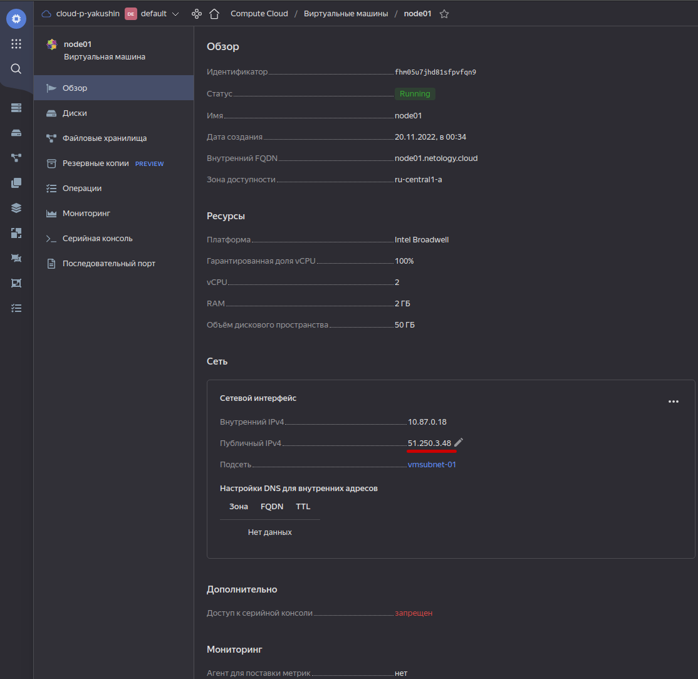
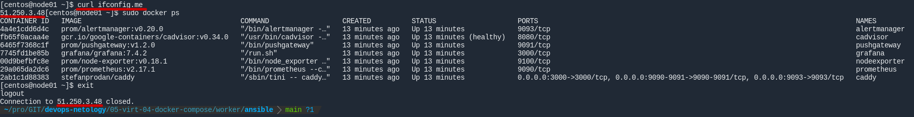
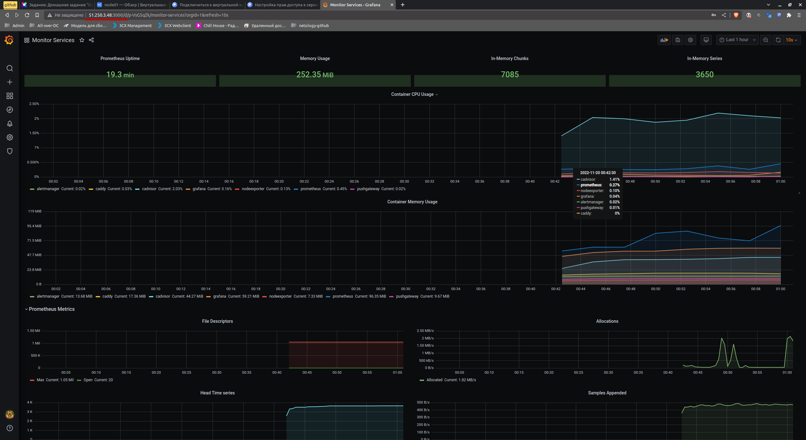

# Домашнее задание к занятию "4. Оркестрация группой Docker контейнеров на примере Docker Compose"

## Задача 1

Создать собственный образ операционной системы с помощью Packer.

Для получения зачета, вам необходимо предоставить:
- Скриншот страницы, как на слайде из презентации (слайд 37).

### Ответ
1. Слайда 37 не существует.

2. [Искомый скриншот](img/packer-image.png)

```shell
❯ yc compute image list
+----------------------+---------------+--------+----------------------+--------+
|          ID          |     NAME      | FAMILY |     PRODUCT IDS      | STATUS |
+----------------------+---------------+--------+----------------------+--------+
| fd8334qlusn476orq2ld | centos-7-base | centos | f2ej5s7bl29i345722rn | READY  |
+----------------------+---------------+--------+----------------------+--------+
```

## Задача 2

Создать вашу первую виртуальную машину в Яндекс.Облаке.

Для получения зачета, вам необходимо предоставить:
- Скриншот страницы свойств созданной ВМ, как на [примере](assets/yc_01.png):

### Ответ


## Задача 3

Создать ваш первый готовый к боевой эксплуатации компонент мониторинга, состоящий из стека микросервисов.

Для получения зачета, вам необходимо предоставить:
- Скриншот работающего веб-интерфейса Grafana с текущими метриками, как на [примере](assets/yc_02.png)

### Ответ



---
`worklog` под сопйлером, дабы не смущать.
<details>

- Поставил себе zsh на хостмашину (Mint 21 Cinnamon)<br> 
- Оставил пока на ней git ansible vagrant vbox<br>
- docker + compose поднимаются внутри vbox, ибо нет уверенности, что далее "вот-это-всё" потребуется на хостмашине.
- опять на хост. установить packer методом репозитория не вышло.  установил бинарник.
- опять на хост. установить terraform методом репозитория не вышло.  установил бинарник.
  - сделать так чтоб не ругалось при ините
```
terraform {
  required_providers {
    yandex = {
      source = "yandex-cloud/yandex"
    }
  }
}
```

и еще нужно создать `nano ~/.terraformrc` <br>
про подробности в [избе читальне](https://cloud.yandex.com/en/docs/tutorials/infrastructure-management/terraform-quickstart)
```shell
provider_installation {
  network_mirror {
    url = "https://terraform-mirror.yandexcloud.net/"
    include = ["registry.terraform.io/*/*"]
  }
  direct {
    exclude = ["registry.terraform.io/*/*"]
  }
}
```

- вот где-то тут сдох пк вместе с пачкой невыполненных пушей
- делаем всё заново
- Ansible - не будет работать пока мы форсированно не укажем на кфг
```shell
export ANSIBLE_CONFIG=/mnt/hgfs/GIT/devops-netology/05-virt-04-docker-compose/worker/ansible/ansible.cfg
```

</details>

---

## Задача 4 (*)

Создать вторую ВМ и подключить её к мониторингу развёрнутому на первом сервере.

Для получения зачета, вам необходимо предоставить:
- Скриншот из Grafana, на котором будут отображаться метрики добавленного вами сервера.

