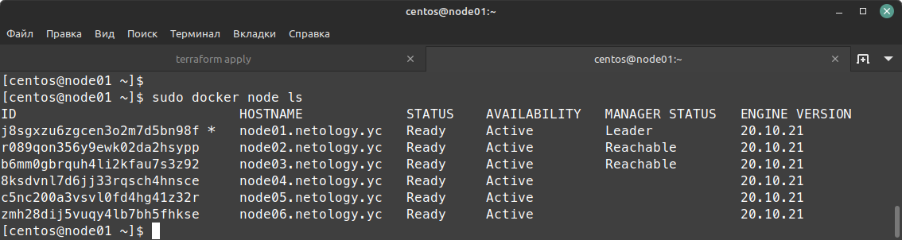
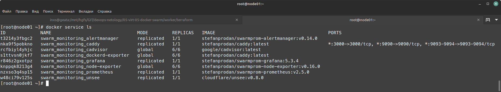
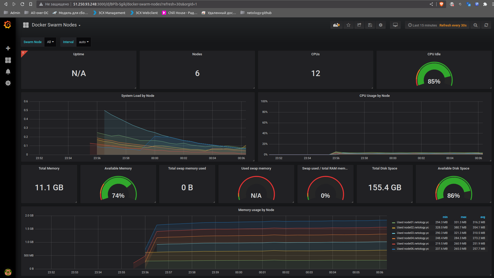
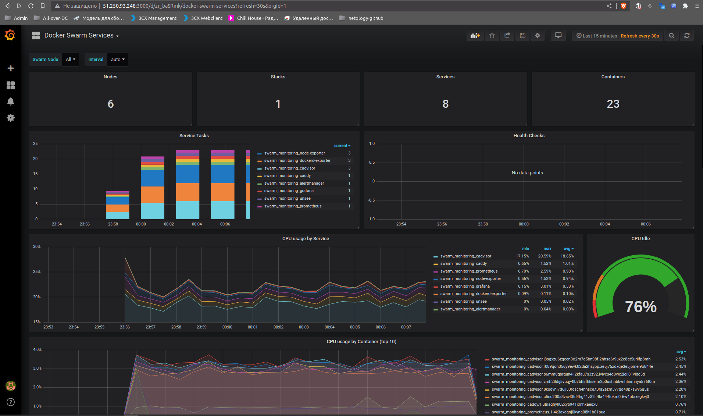

# Домашнее задание к занятию "5. Оркестрация кластером Docker контейнеров на примере Docker Swarm"

## Задача 1

Дайте письменые ответы на следующие вопросы:

- В чём отличие режимов работы сервисов в Docker Swarm кластере: replication и global?
- Какой алгоритм выбора лидера используется в Docker Swarm кластере?
- Что такое Overlay Network?
### Ответ
- В чём отличие режимов работы сервисов в Docker Swarm кластере: replication и global?
  - `Global` - запускает одну задачу на каждой ноде. Предварительно заданного количества задач нет.
  - `Replicated` - запускает указанное количество идентичных задач (реплик).<br> В случае падения какой-либо ноды, Swarm запустит задачу на другой (поддерживает заданное количество реплик).
- Какой алгоритм выбора лидера используется в Docker Swarm кластере?
  - Используется алгоритм `Raft` 
  - Если долго нет ответа от лидера, то нода переходит в состояние кандидата, о чем сообщает остальным нодам.
  - Выборы происходят по принципу - кто был первым, большинством голосов. Если приходит ответ и от лидера, то все обнуляется до следующего инцидента.
  - https://docs.docker.com/engine/swarm/raft/
  - http://thesecretlivesofdata.com/raft/
- Что такое Overlay Network?
  - в понятиях Docker - L3 распределённая логическая сеть между несколькими узлами docker. Тк используется шифрование, позволяет контейнерам и узлам выполнять безопасный обмен данными.

## Задача 2

Создать ваш первый Docker Swarm кластер в Яндекс.Облаке

Для получения зачета, вам необходимо предоставить скриншот из терминала (консоли), с выводом команды:
```
docker node ls
```
### Ответ
```shell
[centos@node01 ~]$ sudo -i
[root@node01 ~]# docker node ls
ID                            HOSTNAME             STATUS    AVAILABILITY   MANAGER STATUS   ENGINE VERSION
j8sgxzu6zgcen3o2m7d5bn98f *   node01.netology.yc   Ready     Active         Leader           20.10.21
r089qon356y9ewk02da2hsypp     node02.netology.yc   Ready     Active         Reachable        20.10.21
b6mm0gbrquh4li2kfau7s3z92     node03.netology.yc   Ready     Active         Reachable        20.10.21
8ksdvnl7d6jj33rqsch4hnsce     node04.netology.yc   Ready     Active                          20.10.21
c5nc200a3vsvl0fd4hg41z32r     node05.netology.yc   Ready     Active                          20.10.21
zmh28dij5vuqy4lb7bh5fhkse     node06.netology.yc   Ready     Active                          20.10.21
```
скрин под катом
<details>



</details>

## Задача 3

Создать ваш первый, готовый к боевой эксплуатации кластер мониторинга, состоящий из стека микросервисов.

Для получения зачета, вам необходимо предоставить скриншот из терминала (консоли), с выводом команды:
```
docker service ls
```
### Ответ
```shell
root@node01 ~]# docker service ls
ID             NAME                                MODE         REPLICAS   IMAGE                                          PORTS
t3214y3fbgc2   swarm_monitoring_alertmanager       replicated   1/1        stefanprodan/swarmprom-alertmanager:v0.14.0    
nka9f5pobkno   swarm_monitoring_caddy              replicated   1/1        stefanprodan/caddy:latest                      *:3000->3000/tcp, *:9090->9090/tcp, *:9093-9094->9093-9094/tcp
rcfbiyl4yhjc   swarm_monitoring_cadvisor           global       6/6        google/cadvisor:latest                         
s1ttvsn0jkf7   swarm_monitoring_dockerd-exporter   global       6/6        stefanprodan/caddy:latest                      
r846z2gxotpz   swarm_monitoring_grafana            replicated   1/1        stefanprodan/swarmprom-grafana:5.3.4           
knppqk8213g4   swarm_monitoring_node-exporter      global       6/6        stefanprodan/swarmprom-node-exporter:v0.16.0   
nzxso3q4sp15   swarm_monitoring_prometheus         replicated   1/1        stefanprodan/swarmprom-prometheus:v2.5.0       
w48ci79v125s   swarm_monitoring_unsee              replicated   1/1        cloudflare/unsee:v0.8.0                        
```
скрины под катом
<details>

<br>
<br>


</details>

## Задача 4 (*)

Выполнить на лидере Docker Swarm кластера команду (указанную ниже) и дать письменное описание её функционала, что она делает и зачем она нужна:
```
# см.документацию: https://docs.docker.com/engine/swarm/swarm_manager_locking/
docker swarm update --autolock=true
```
        
